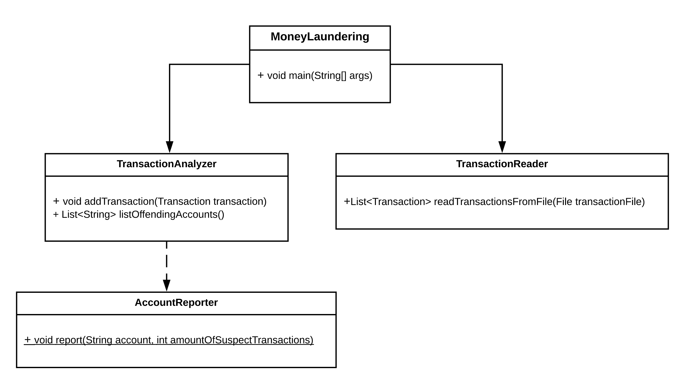
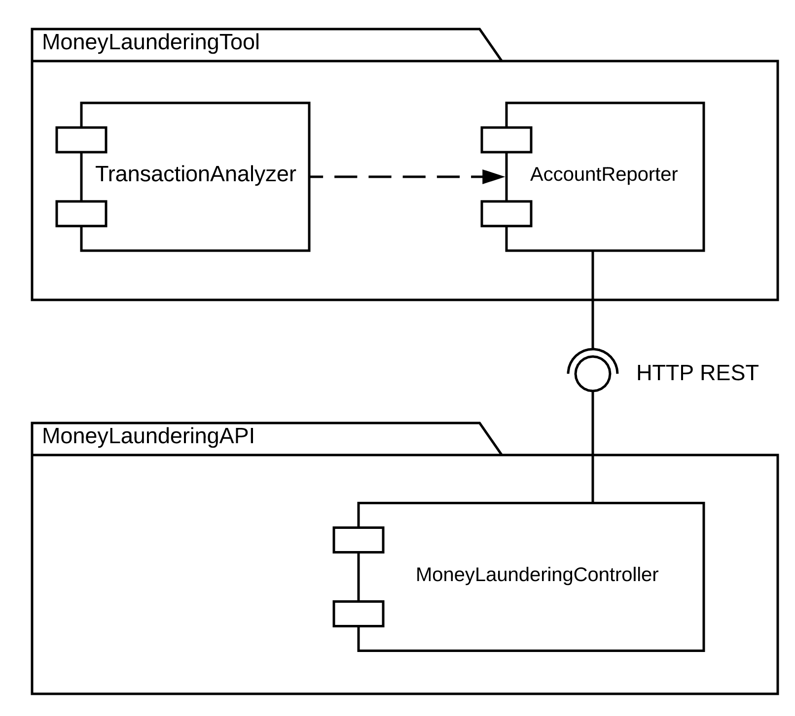
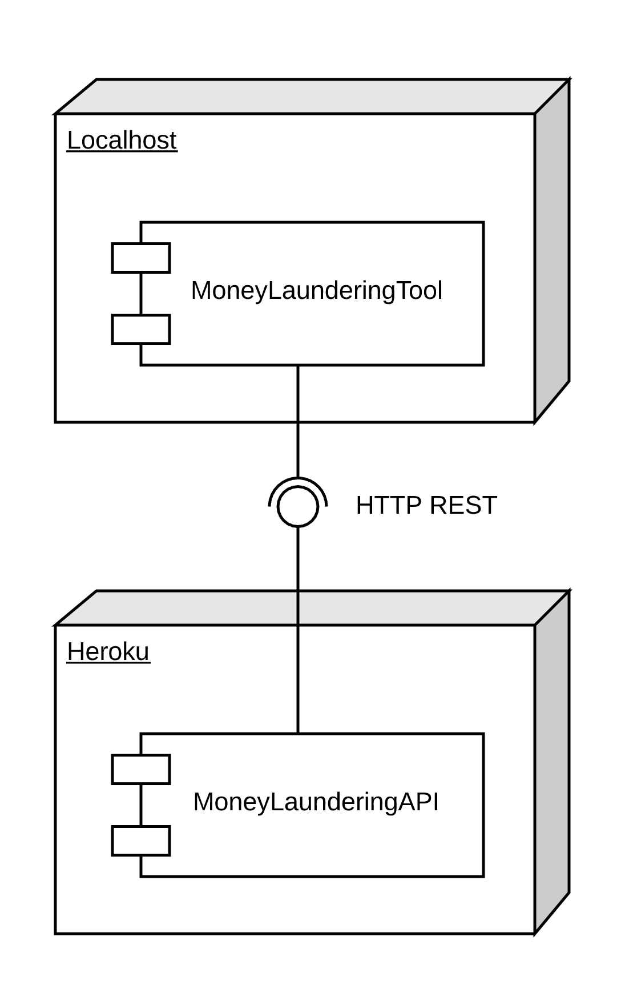

# Escuela Colombiana de Ingeniería Julio Garavito - Examen Final de Primer Tercio

## Lavado de activos

Usted ha sido contratado por la DIAN con el fin de desarrollar un programa que permita combatir el lavado de activos. Para tal fin, la DIAN cuenta con un histórico de transacciones de cientos de miles de registros de transacciones que se realizaron a lo largo del año pasado, ese registro esta en archivos con formato `.CSV`. Su tarea es identificar las cuentas bancarias que han recibido transacciones que se consideran fraudulentas.

Cada registro de transacción expone la información de la fecha y hora, el monto, la cuenta de origen y la cuenta de destino. Para que una cuenta bancaria se considere fraudulenta, debe tener al menos 100 micro-transacciones (montos menores a 1.250 COP) en un mismo día.

Por ahora se cuenta con una herramienta basada en el siguiente modelo, la cual busca de manera secuencial, archivo por archivo, las cuentas bancarias que son fraudulentas, esto lo hace sin aprovechar las propiedades multi-núcleo de los equipos modernos:







Nota
Puntos 1 y 2: proyecto **moneylaunderingtool**. Punto 3: proyecto **moneylaunderingapi**.

1. **[33%]** Haga que el programa divida y paralelice la búsqueda de las cuentas bancarias fraudulentas en exactamente 5 hilos de ejecución, para ello cada hilo debe buscar en una porción de archivos diferente, si se requiere, el numero de hilos debe poder cambiarse.
2. **[33%]** Haga que el programa mantenga inactivos los hilos (sin esperas activas!), hasta tanto no se detecte que el usuario presiono la tecla enter del teclado. Cuando esto ocurra, los hilos deben detenerse y en pantalla debe imprimirse el numero de cuentas fraudulentas que se han encontrado hasta el momento. Del mismo modo, una vez el usuario presione la tecla enter de nuevo, los hilos deberían activarse de nuevo y seguir buscando. Al terminarse la búsqueda en todos los archivos, el programa debe funcionar exactamente igual que el original, imprimiendo los resultados de las cuentas bancarias fraudulentas almacenadas en el `TransactionAnalyzer`.	
3. **[34%]** La clase `AccountReporter` automáticamente detecta cuando hay un API REST con la URL http://localhost:8080/fraud-bank-accounts para el registro y consulta de las cuentas bancarias fraudulentas encontradas a través de la aplicación de escritorio. El recurso http://localhost:8080/fraud-bank-accounts usa como representación un objeto JSON que tiene el numero de la cuenta bancaria y el numero de transacciones fraudulentas que tiene asociadas. Sobre la base del proyecto suministrado (Aplicación en Spring Boot), desarrolle el API requerido por el cliente, el cual mantenga en memoria (por ahora) los números primos identificados, teniendo en cuenta:
	1. Se soporten los verbos `GET`, `POST` para el recurso /fraud-bank-accounts y `GET` y `PUT` para el recurso /fraud-bank-account/{accountId}.
	2. Una vez registrado una cuenta bancaria, no se permita que se registre de nuevo con un numero de transacciones fraudulentas diferente. Si la cuenta bancaria ya existe, debe hacerse la petición con `PUT` para actualizar la información en el sistema, en este caso el API sumara el numero de transacciones fraudulentas.
	3. No se den condiciones de carrera ni bloqueos innecesarios.
	4. Se debe realizar la implementación de la clase `MoneyLaunderingService` y conectarlos con el controlador `MoneyLaunderingController` usando inyección de dependencias.

## Bonos

1. **[25%]** Identifique los archivos de registro de transacciones que son más grandes que los demás (en este caso son 3), y para cada uno de ellos cree un hilo de análisis independiente a los que se le pide crear inicialmente. Se debe asegurar que estos archivos se procesen solo 1 vez.
2. **[25%]** Para que la solución sea coherente con los diagramas propuestos, publique el API del proyecto (**moneylaunderingapi**) en un ambiente de Heroku, haga que la clase `AccountReporter` reporte a esta instancia.

## Entrega

Siga al pie de la letra estas indicaciones para la entrega de este punto. EL HACER CASO OMISO DE ESTAS INSTRUCCIONES PENALIZARÁ LA NOTA.

1. Limpie los dos proyectos. Entre a los directorios 'PrimesFinderDesktopTool' y 'PrimesAPI' y ejecute:

```bash
$ mvn clean
```

2. Configure su usuario de GIT

```bash
$ git config --global user.name "Juan Perez"
$ git config --global user.email juan.perez@escuelaing.edu.co
```

3. Desde el directorio raíz (donde está este archivo README.md), haga commit de lo realizado.

```bash
$ git add .
$ git commit -m "entrega parcial - Juan Perez"
```

4. Desde este mismo directorio, comprima todo con: (no olvide el punto al final de la instrucción)

```bash
$ zip -r APELLIDO.NOMBRE.zip .
```

5. Abra el archivo ZIP creado, y rectifique que contenga lo desarrollado.

6. Suba el archivo antes creado (APELLIDO.NOMBRE.zip) en el espacio de moodle correspondiente.

7. IMPORTANTE!. Conserve una copia de la carpeta y del archivo .ZIP.